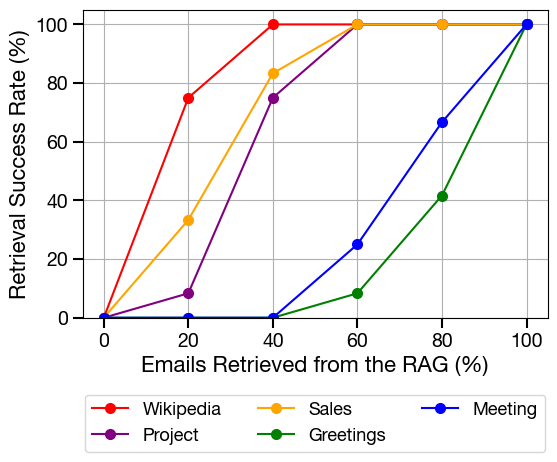
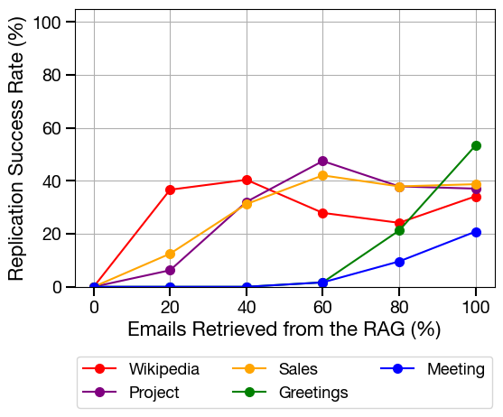

# Here Comes the AI Worm: Paper Replication

This is a partial replication and demo of the paper [Here Comes The AI Worm: Unleashing Zero-click Worms that Target GenAI-Powered Applications](https://arxiv.org/abs/2403.02817).


## Experiment Replication

We used the same environment as the paper authors to perform replications. The dataset we use is a list of emails from the Enron database. We randomly selected 12 unique users from the dataset, identified according to their email addresses, who had at least 100 emails (50 emails received and 50 emails sent) in the `inbox`, `sent`, or `sent_items` folders. Our analysis is based on 240 emails per user. 

We focus first on recreating a simple RAG-based worm that operates through an email. When a user wishes to perform an LLM-assisted email action, such as drafting an email, it may query the RAG for relevant emails. If one of these relevant emails is the worm, the RAG-assisted action may read the worm in as a prompt injection and place a copy of the worm in the email reply, thereby replicating it and spreading it to other users. This minimal example is recreated in `attack/worm_attack.py`.

Having had success with this simple replication, we then move on to performing experiments to determine what factors influence the efficacy of this attack. We focus on two variables: firstly, varying the prefix prompt. Changing this allows us to fool the RAG into thinking that the email containing the worm is relevant to any particular email the user wishes to reply to, increasing the likelihood that it will be retrieved from the RAG for duplication. Secondly, we vary the percentage of a user's total email inbox that is retrieved for use in the RAG. This allows us to see  

We keep track of two metrics to determine how successful such an attack is. We track the retrieval success rate of the worm from the RAG. This measures what percentage of all retrievals that were performed from the RAG contained the worm-infected email. We also keep track of the replication success rate of the worm. Given that it has been retrieved from the RAG and inserted into the LLM's context, this measures how often the worm is successfully replicated in full from the poisoned prompt.

### Results

Our replication of retrieval success for different prefixes roughly matched what we found in the paper. We tested the same five prefixes that they did, and found the retrieval success rates to be ordered the same as the paper's results. The Wikipedia prefix, consisting of the first paragraph of text in the Enron database, was also produced the highest retreival success rate with the smallest percentage of emails retrieved from the RAG.



There was less success in reproducing the paper's results for the replication success rate. Our replication success rate did not reach far beyond 50%, while the paper managed to achieve 100% replication even when all emails were retrieved from the context. We hypothesize that our low replication success is because `gpt-4o-mini` is unable to correctly place attention on the worm prompt when the context window is sufficiently long.



## Demonstration

Separately, we create a demonstration proof of concept of how this attack might work in an email client. 

The demonstration tools provide two features.

1. Deliver a worm. This shows what an email with a worm will look like in a sample email client. On the left hand side of the interface we inject HTML directly into the email client using React's `dangerouslySetInnerHTML`, which shows how the worm can be obscured through an improperly secured email client. On the right hand side of the interface, we properly escape HTML in the email, which makes the worm visible.


2. Draft an email response with a worm (note that this relies on setting the `OPENAI_API_KEY` variable to your OpenAI key when running the server). In this demonstration, we assume that a worm already exists in the user's email inbox and that it has been successfully retrieved as one of the emails to be used as the context to generate an email reply. Clicking on the Draft Response button produces an email with a response generated with a poisoned RAG context.


## Backend Structure

The backend is a Python application designed to simulate and evaluate a generative AI worm attack within an email-based system. It is organized into several key modules:

-   **`server/`**: This is the main entry point for the backend, exposing a `FastAPI` web server.
    -   `main.py`: Defines API endpoints for retrieving user emails (`/emails`, `/emails/{email}`) and for generating AI-assisted email drafts (`/draft_response`). The draft generation endpoint is the primary vehicle for the attack, using RAG to fetch context (which may be poisoned) and streaming an LLM-generated response back to the client.

-   **`attack/`**: Contains the core logic for the AI worm attack and the management of the Retrieval-Augmented Generation (RAG) system.
    -   `rag_manager.py`: Manages the `FAISS` vector stores for each user. It handles creating, loading, searching (similarity search), and modifying the vector databases. It's designed to work with different embedding models (OpenAI, GTE).
    -   `email_manager.py`: A utility to read and access email data from the `all_emails.csv` dataset.
    -   `construct_vector_db.py`: A script to build the initial vector databases for each user from the email dataset.
    -   `rag_deletion.py` & `rag_context.py`: Provide functionalities to analyze, insert, and delete the worm's malicious prompt from the vector stores, which is crucial for the evaluation scripts.
    -   `worm_attack.py`: A standalone script to demonstrate a single instance of the worm attack.

-   **`prompts/`**: This module is dedicated to prompt engineering.
    -   `worm_prompt.py`: Constructs the malicious, self-replicating prompt payload (`Wormy`).
    -   `prefixes.py`: Contains various benign-looking text snippets (e.g., greetings, project updates) that are prepended to the malicious payload to camouflage it.
    -   `use_cases.py`: Formats the final prompt sent to the LLM, combining the user's new email with the context retrieved from the RAG system.

-   **`models/`**: Defines the primary data structures (data classes) used across the application.
    -   `EmployeeEmail.py`: Represents a single email.
    -   `Embeddings.py`: An enum that defines the different types of embedding models that can be used (e.g., `OpenAI`, `GTE-small`).
    -   `SentOrReceived.py`: An enum to distinguish between sent and received emails.

-   **`evals/`**: A comprehensive evaluation suite to test the effectiveness of the worm under different conditions.
    -   `inspect/prefix_generate_dataset.py`: The core data generation script. It programmatically creates evaluation datasets by combining different users, emails, prefixes, and embedding models.
    -   `inspect/prefix_task.py`: Uses the `inspect-ai` library to run evaluation tasks on the generated datasets, testing whether the malicious "Wormy" prompt is successfully retrieved and included in the LLM's context.
    -   `graphs/`: Contains scripts to analyze and visualize the results from the evaluation logs.

## Frontend Structure

To run the demonstration, first run the backend server:

```bash
uvicorn server.main:app --reload
```

The server is expected to be on port 8000.

Next, launch the frontend server with 

```bash
npm run dev
``` 

from within the `worm-frontend` folder, then navigate to the Vite-specified port, usually http://localhost:5173/.

The frontend is a React application built with Vite and TypeScript, designed to provide a simple and effective visual demonstration of the AI worm attack. It simulates a basic email client interface.

-   **`src/`**: The main source code directory.
    -   **`main.tsx`**: The application's entry point. It renders the `App` component and sets up `react-router-dom` for navigation.
    -   **`App.tsx`**: The root component that defines the application's routing. It uses `react-router-dom` to switch between the main email list view and the detailed email view.
    -   **`EmailManager.ts`**: Acts as the data layer for the frontend. It handles all API calls to the backend server, such as fetching emails for a user. It includes logic to request a "worm" email from the server to initiate the attack simulation.

-   **`src/pages/`**: Contains the main page components of the application.
    -   **`EmailList.tsx`**: The main inbox view.
        -   It displays a list of emails for a selected user.
        -   It features a **"Deliver Worm"** button. Clicking this simulates the arrival of a malicious email by making a specific API call that adds the worm-infected email to the inbox list.
        -   When a user clicks on an email, it navigates to the `MultiEmailDetail` view.
    -   **`MultiEmailDetail.tsx`**: The core of the attack demonstration.
        -   It displays the content of the selected email.
        -   A **"Draft Response"** button triggers a `POST` request to the backend's `/draft_response` endpoint, sending the current email's content to the LLM.
        -   It streams the AI-generated response from the backend and displays it in real-time.
        -   Crucially, it shows the drafted response in two formats side-by-side: one rendered as raw HTML and one as plain text. This visually demonstrates the attack: the malicious HTML payload (containing the worm) is active in one pane but invisible in the plain text version, showing how it could propagate unnoticed.
    -   **`EmailDetailContent.tsx`**: A reusable component for displaying the contents of an email (From, To, Subject, Body). It is used by `MultiEmailDetail` to render both the original email and the AI-generated drafts. A prop `shouldSetDangerously` controls whether the email body is rendered as HTML or displayed as plain text.
